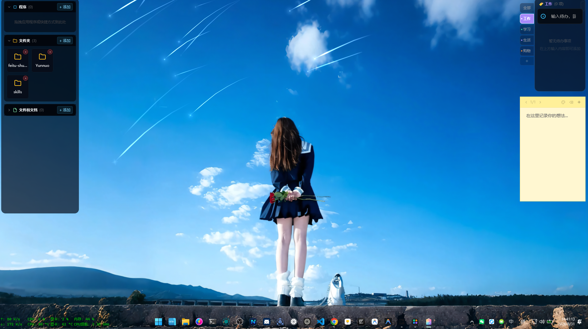
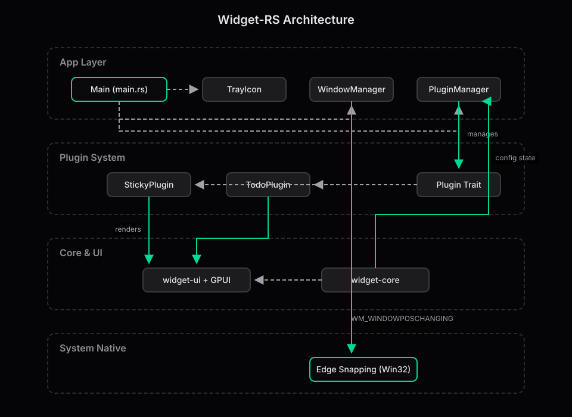

# Widget-RS 🎨

[](https://github.com/tierlabx/widget-rs/actions/workflows/packager.yml)
[](https://www.rust-lang.org)
[](https://opensource.org/licenses/MIT)

基于 **Rust + GPUI** 构建的轻量级、高性能桌面小部件系统，支持始终置顶、鼠标穿透、原生边缘磁吸、系统托盘驱动，以及完善的插件化扩展能力。

<p align="center">
  
</p>

---

## 🌟 特性 (Features)

- **⚡ 极致性能与现代渲染**
  - 基于 **Rust + GPUI** 现代 GPU 渲染引擎，冷启动毫秒级响应，低 CPU/GPU 占用（基础常驻内存仅约 30MB~50MB）。
  - 接入 DirectComposition 硬件透明通道，直通 Windows 桌面壁纸，告别原生窗口黑白闪烁与边框瑕疵。

- **🪟 深度原生桌面级窗口体验**
  - **Win+D 桌面常驻保护**：深度挂载至系统 `Progman`，用户按下 `Win+D`（显示桌面）时始终与壁纸同存，绝不被误最小化。
  - **聚焦独立与防联动**：底层精准拦截被动 Z 序联动事件，单独激活一个小组件绝不会连带拉起其他桌面兄弟组件。
  - **双模层级与穿透**：支持在“桌面壁纸融入层”与“全局始终置顶（`HWND_TOPMOST`）”间无缝热切换，并支持单点开启鼠标穿透（透明点击）。

- **🧲 丝滑吸附与统一排版系统**
  - **多屏物理磁力吸附**：拖拽靠近多屏幕边缘或相邻组件时自动产生物理磁吸，支持边缘贴靠、居中对齐与精准吸附。
  - **一键排版编辑模式**：框架级统一渲染拖拽手柄、层级与位置调节，布局记忆毫秒级自动持久化，重启自动精准还原。

- **🧩 强内聚、高度解耦的插件生态**
  - 核心遵循 `WidgetWindow<T>` 统一容器规范，插件仅需实现 `WidgetContent` 业务逻辑，无需处理拖拽手柄、编辑模式与窗口样板。
  - **丰富内置组件**：便签 (`Sticky`)、极简待办 (`Todo`)、健康休息提醒 (`Stretchly`)、桌面图标收纳栅格 (`Fences`)。
  - **全自动工程脚手架**：内置 `widget-cli` 命令行工具，支持源码级一键创建、注册、构建与扩展新插件。

- **🎛️ 现代控制中心与统一设置体系**
  - 现代深色美学控制面板，集中化管理插件开关、开机自启、全局排版模式切换与托盘常驻。
  - 规范化独立设置弹窗（`render_settings_shell`），提供全局 100% 统一的交互动效与视觉语言。

---

## 🏗 架构设计 (Architecture)

Widget-RS 采用分层与插件化架构，保证核心稳定性的同时允许极大的扩展自由：

<p align="center">
  
</p>

---

## 🚀 快速开始

### 1. 环境准备
确保你已经安装了较新版本的 [Rust](https://rustup.rs/) (建议 1.75+)。

### 2. 构建与运行
```bash
git clone https://github.com/your-username/widget-rs.git
cd widget-rs

# 运行调试版本
cargo run

# 构建发布版本
cargo packager --release
```

### 3. 操作指南
- **排版模式**: 右键系统托盘图标，点击 **“控制面板”**，开启排版模式即可拖拽小部件、感受边缘吸附。
- **配置保存**: 所有的小部件位置、大小及开启状态都会持久化到本地配置文件中，下次启动自动还原。

---

## 🧩 插件管理 (CLI)

Widget-RS 提供了一个强大的命令行工具 `widget-cli`，用于源码级别的插件一键安装与卸载，确保你在享受原生高性能渲染的同时，轻松扩展功能。

### 安装与卸载插件
```bash
# 添加一个本地插件 (自动注入 Cargo.toml 与 源码注册表)
cargo run -p widget-cli -- plugin add <插件名称> --path <本地路径>
# 示例：
cargo run -p widget-cli -- plugin add my_clock --path ../plugins/my_clock

# 卸载一个已安装的插件
cargo run -p widget-cli -- plugin remove <插件名称>
# 示例：
cargo run -p widget-cli -- plugin remove sticky_plugin
```

### 开发你自己的插件
想要开发自己的插件，你只需要：
1. 创建一个新的 Rust 库 (`cargo new --lib plugins/my_plugin`)
2. 引入 `widget-core` 依赖
3. 遵循 **UI与逻辑分离规范**，建立 `model.rs` 存放数据逻辑，`view.rs` 存放渲染代码。
4. 在 `view.rs` 中实现 `widget_core::WidgetContent` Trait（只需提供 `plugin_id` 和 `drag_label`），窗口级能力（编辑模式、拖拽、边框）由 `WidgetWindow` 容器自动提供。
5. 在 `lib.rs` 中实现 `widget_core::Plugin` Trait，使用 `WidgetWindow` 包装你的内容：
```rust
fn spawn_window(&self, cx: &mut App) -> AnyWindowHandle {
    let options = widget_core::default_widget_window_options(cx, "my_plugin", (100.0, 100.0, 300.0, 300.0));
    cx.open_window(options, |window, cx| {
        let content = cx.new(|cx| MyWidget::new(window, cx));
        let widget_window = cx.new(|_cx| widget_core::WidgetWindow::new(content));
        cx.new(|cx| gpui_component::Root::new(widget_window, window, cx))
    }).unwrap().into()
}
```
6. 使用 CLI 将其添加到主程序中编译运行！

> 详细的 API 说明和完整示例请参考 [插件开发指南](docs/插件开发指南.md)。

---

## 🔖 版本发布 (Release)

Widget-RS 内置了基于 [Conventional Commits](https://www.conventionalcommits.org/) 的版本发布工具，自动计算版本号、更新 `Cargo.toml`、生成 `CHANGELOG.md`、提交并推送 tag。

```bash
# 自动根据 commit 历史计算版本号并发布
cargo run -p widget-cli -- release

# 预览下一个版本（不做任何修改）
cargo run -p widget-cli -- release --dry-run

# 手动指定版本号
cargo run -p widget-cli -- release --version 0.2.0
```

推送 tag 后，GitHub Actions 会自动触发打包并创建 GitHub Release。

## 🛠 技术栈

| 领域 | 核心技术 | 说明 |
| :--- | :--- | :--- |
| **渲染引擎** | [GPUI](https://gpui.rs/) | 极速、现代的 Rust UI 框架 |
| **UI 组件库**| gpui-component | 构建标准 UI 控件 |
| **底层交互** | windows-sys 0.52 | 原生窗口消息拦截、边缘吸附处理 |
| **系统托盘** | tray-icon | 跨平台系统托盘支持 |
| **工程构建** | widget-cli, GitHub Actions | 内置版本发布工具与 CI/CD 自动打包 |

---

## 🤝 参与贡献 (Contributing)

我们非常欢迎开发者参与贡献！无论你是想修复 Bug、开发新的小部件插件、还是改进文档，请参阅 [贡献指南 CONTRIBUTING.md](CONTRIBUTING.md) 了解详细的开发流程与规范。

## 💖 鸣谢 (Acknowledgements)

Widget-RS 的诞生离不开开源社区的坚实基石与优秀项目的灵感启发，特别鸣谢：

- [Zed Industries / GPUI](https://github.com/zed-industries/zed) — 极速、现代且优雅的 GPU 驱动 UI 渲染引擎。
- [gpui-component](https://github.com/longbridge/gpui-component) — 丰富的 GPUI 基础组件库支持。
- [Tauri Team](https://github.com/tauri-apps) — 优秀的跨平台底层支撑（`tao` 与 `tray-icon`）。
- [Folia-Major](https://github.com/chthollyphile/folia-major) — 沉浸式动效与音乐律动设计为桌面组件带来了绝佳的视觉灵感。
- 感谢每一位参与贡献、提出 Issue 与改进建议的开发者！

## 📄 开源协议

本项目基于 MIT 协议开源。详细信息请参阅 [LICENSE](LICENSE) 文件。
