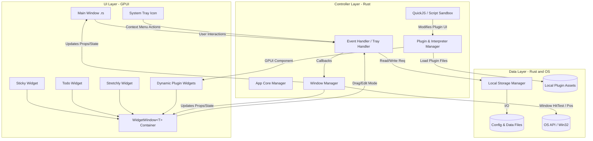

# Widget RS - Architecture Design

<p align="center">
  <strong>English</strong> | <a href="../架构设计.md">简体中文</a>
</p>

## 1. System Architecture Overview

Widget-RS follows a clean **Three-Tier Architecture (UI Layer - Controller Layer - Data Layer)**, extended with a dynamic plugin sandbox system in the Controller Layer to support both native Rust widgets and external JavaScript extensions.



---

## 2. Core Architectural Layers

### 2.1 UI Layer (Presentation)
Contains statically compiled UI (dashboard, built-in widgets) as well as runtime-interpreted dynamic extensions.
- **Role**: Defines layout, styling, animations, and interactive event triggers.
- **`WidgetWindow<T>` Container**: All widgets (built-in and third-party) are wrapped inside the `WidgetWindow<T>` container. It encapsulates edit mode detection, drag handle rendering (`#00d992`), border switching, and `update_window_edit_mode` platform hooks. Plugins only need to implement the `WidgetContent` trait to inherit full window capabilities.
- **Dynamic Plugin Widgets**: External JavaScript extensions (ES Modules + `View` class) executed via the official `gpui-shell` engine. Elements map directly to the GPUI GPU pipeline, sharing identical DirectComposition transparency and `Progman` desktop residency with native widgets.

### 2.2 Controller Layer (Business Orchestration)
The central runtime hub written in Rust.
- **App Core Manager & Window Manager**: Manages event dispatching, multi-window handles, edge snapping, and Win32 window message hooks (`plugin_wnd_proc`).
- **Plugin & Extension Manager**: Manages plugin lifecycles, scanning native plugins and external JS extensions, and handling hot-reloading.
- **GPUI Shell Execution Sandbox (`gpui-shell`)**: Embedded QuickJS JIT JavaScript runtime. Includes modern ES Module resolution, DOM-free reactive state notifications (`cx.notify()`), native timer events (`cx.timer.every`), and GPUI style reflection, safely isolating third-party logic while exposing host capabilities.

### 2.3 Data Layer (Persistence & OS Calls)
- **Local Storage Manager**: Provides structured serialization APIs for settings and plugin data, managing local extension files under `%APPDATA%/tierlabx/widget-rs/`.
- **Unidirectional Data Flow**: UI actions notify the Controller layer, which atomically persists updates and broadcasts updated state to active views.

---

## 3. Widget Window Hierarchy Model

```
┌─────────────────────────────────────────────────┐
│  WidgetWindow<T>      (widget-core)             │  ← Framework-managed
│  ├── Edit mode detection (UIState::is_edit_mode)│
│  ├── Drag handle (#00d992)                      │
│  ├── Edit mode border highlight                 │
│  ├── update_window_edit_mode (WS_THICKFRAME)    │
│  │                                              │
│  │  ┌───────────────────────────────────┐       │
│  │  │  T: WidgetContent                 │       │  ← Plugin only implements this
│  │  │  ├── plugin_id()                  │       │
│  │  │  ├── drag_label()                 │       │
│  │  │  ├── show_drag_handle()           │       │
│  │  │  └── render() → Feature UI        │       │
│  │  └───────────────────────────────────┘       │
│  │                                              │
└─────────────────────────────────────────────────┘
```

---

## 4. Event Loop & Application Lifecycle

1. **Initialization**: Rust `main()` starts, initializing the GPUI context and loading configuration from local storage.
2. **Plugin Loading**: Plugin Manager discovers registered native plugins and scans `extensions/` directories.
3. **Window Spawning**: Plugins invoke `spawn_window()`, wrapping their custom view inside `WidgetWindow::new(content)`. The Window Manager registers window handles and applies Win32 desktop styles.
4. **Runtime Execution**:
   - `WidgetWindow` reads `UIState::is_edit_mode` on each frame, conditionally rendering the drag handle and applying resize borders.
   - The plugin's `WidgetContent::render()` focuses solely on its own business UI.
   - User actions trigger controller callbacks, updating state and notifying GPUI for minimal re-renders.
5. **Special Interaction States (Snapping, Click-Through)**: Managed transparently by the host Window Manager across all native and script widgets.
6. **Teardown**: Notifies running runtimes, cleans up Win32 hooks, and flushes data to disk.
